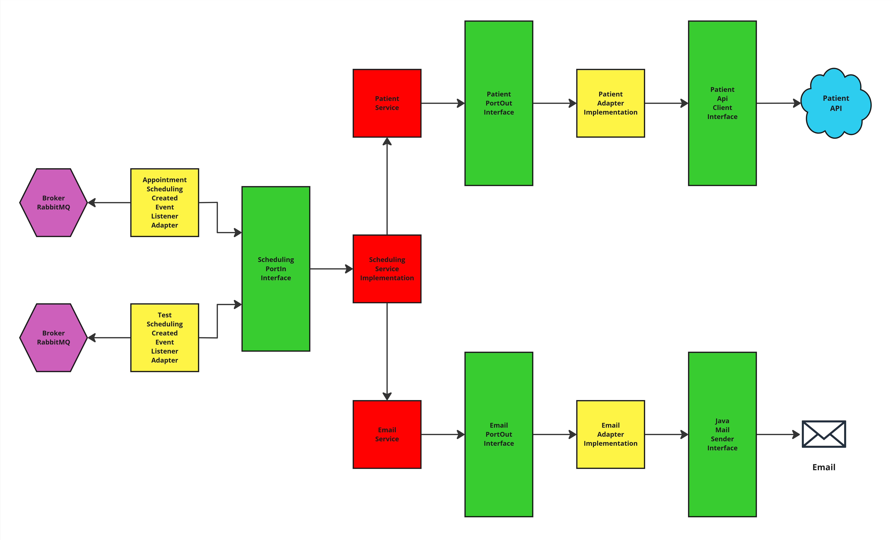

# Hackathon Fiap - Fase 5

# Pós Tech - Arquitetura e Desenvolvimento Java - Fiap - 2024/25

- **Grupo 11:**
    - **[Pedro Ono](https://github.com/pedr0no) - RM 354950**
    - **[Elton Xavier Souza](https://github.com/eltonxs) - RM 354254**
    - **[Welder Ressutti](https://github.com/welderessutti) - RM 354557**

# Glicare - Sistema de Gerenciamento de Resultado de Exame e Agendamento

## Microsserviço de Gerenciamento de Diagnóstico

**Microsserviço desenvolvido por:** Welder Ressutti

Sua responsabilidade no sistema **Glicare** é gerenciar diagnósticos, executando operações **CRUD** e processando
eventos do broker enviados pelo microsserviço de resultados de exames.

A análise diagnóstica utiliza **IA** para determinar se o paciente precisa de um novo **exame** para controle ou de uma
**consulta médica** para avaliação, registra o diagnóstico no banco de dados e envia eventos ao broker para o
microsserviço de agendamento processar.

A persistência dos dados é feita em um banco **PostgreSQL**, com gerenciamento de migração de schemas via **Flyway**.

Exceções personalizadas são tratadas globalmente por **Rest Controller Advice** e **Exception Handler**, garantindo
respostas padronizadas com **timestamp**, **status code**, **error**, **message** e **path**.

_***Importante**: A funcionalidade de **IA** ainda **não foi implementada** neste MVP, mas faz parte do escopo do
sistema._

### Fluxo de Dados Mensageria

- **Recebe** a mensagem do **broker** com o resultado do exame.
- **Aplica** as **regras de negócio** com base nos valores de referência e, com auxílio da **IA**, classifica o
  resultado como **normal**, **alterado** ou **crítico**.
- **Registra** o diagnóstico no banco de dados, incluindo **ID do exame, ID do paciente, status do diagnóstico e
  data/hora**.
- **Encaminha** a mensagem ao **broker**, direcionando para:
    - **Canal de agendamento de consulta**, se o status for **crítico**.
    - **Canal de agendamento de exame**, caso contrário.

#### Valores de referência da HbA1c:

✅ **Normal:** Abaixo de **5,7%**  
⚠️ **Pré-diabetes:** Entre **5,7% e 6,4%**  
❌ **Diabetes:** **6,5% ou mais**

### Funcionalidades e Endpoints

#### Criação de Diagnóstico (POST)

**Endpoint:** ``/api/diagnosis``

É realizado validação dos dados, **ID do exame, ID do paciente, resultado do exame, status do diagnóstico (enum)**,
todos são obrigatórios.

#### Atualização de Paciente (PUT)

**Endpoint:** ``/api/diagnosis/{diagnosisId}``

É realizado validação dos dados, **ID do exame, ID do paciente, resultado do exame, status do diagnóstico (enum)**,
todos são obrigatórios.

#### Leitura de Paciente (GET)

**Endpoint:** ``/api/diagnosis/{diagnosisId}`` ``/api/diagnosis``

Pode ser obtido o diagnóstico pelo seu **id**. Também é possível obter **todos** os diagnósticos de uma vez.

#### Deleção de Paciente (DELETE)

**Endpoint:** ``/api/diagnosis/{diagnosisId}``

Para deletar um diagnóstico basta passar seu **id** no endpoint.

### Tecnologias

- **Spring Web** – Base para a construção das APIs RESTful do sistema.
- **Spring Data JPA** – Gerenciamento da persistência de dados e integração com o banco de dados.
- **PostgreSQL** – Banco de dados relacional utilizado para armazenar as informações do sistema.
- **Spring Cloud** – Conjunto de ferramentas para facilitar a arquitetura baseada em microsserviços.
- **Spring Cloud Stream** – Implementação de mensageria para comunicação assíncrona entre microsserviços via RabbitMQ.
- **RabbitMQ** – Message broker utilizado para integração assíncrona entre os microsserviços.
- **Flyway** – Controle de versionamento do banco de dados, garantindo migrações seguras.
- **Spring Validation** – Validação de dados recebidos nas requisições das APIs.
- **Lombok** – Redução de boilerplate no código, simplificando a criação de classes Java.

### Arquitetura

A arquitetura hexagonal consiste na ideia de utilizar portas e adaptadores para realizar a integração entre a camada
externa e interna, isolando o core da aplicação para que alterações externas não interfiram nas regras de negócio e
casos de uso.

Este microsserviço foi desenvolvido seguindo os padrões de API RESTful, arquitetura hexagonal, e também respeitando os
princípios SOLID de isolamento de responsabilidades.

A arquitetura desta aplicação foi desenvolvida da seguinte forma:



### Executando a aplicação (isoladamente)

#### Pré-requisitos

- **Git** (caso queira clonar o repositório, mas você pode apenas baixá-lo):
    - [Git](https://git-scm.com/downloads)
- **Docker Desktop** (para executar a aplicação através de containers):
    - [Docker](https://www.docker.com/products/docker-desktop/)

#### Passo 1: Clonar ou baixar o repositório

Para clonar o repositório, use o comando:

```bash
git clone https://github.com/welderessutti/api-diagnosis
```

Caso não queira clonar o repositório, você pode baixá-lo
em [GitHub](https://github.com/welderessutti/api-diagnosis).

#### Passo 2: Executar a aplicação com Docker

No terminal, dentro do diretório raíz do projeto (local onde se encontra o arquivo **compose.yaml** da aplicação),
execute o comando abaixo para subir todos os containers da aplicação:

```bash
docker compose up -d
```

O Docker tentará baixar a imagem no repositório
do [Docker Hub](https://hub.docker.com/repository/docker/welderessutti/api-diagnosis/general), caso ele não
encontre a imagem, ele realizará a **build** da aplicação **(.jar)**, criará a imagem e executará os containers
automaticamente.

Antes do container da aplicação subir, ele aguardará o container do banco de dados **PostgreSQL** estar pronto
utilizando um **healthcheck**, quando pronto, o container da aplicação inicia, e realizará a migração do banco de dados
e suas tabelas automaticamente utilizando o **Flyway**, e estará disponível para acesso em:

```
http://localhost:8080/api/diagnosis
```
